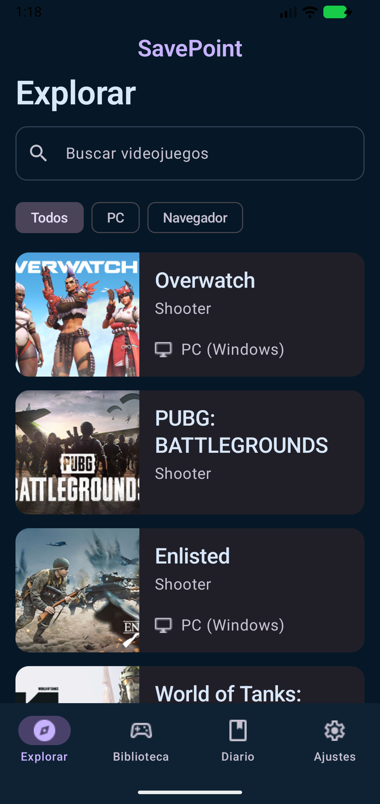
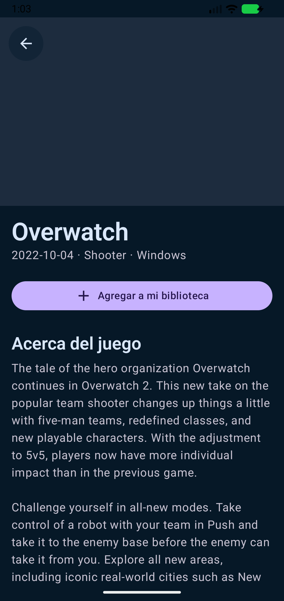
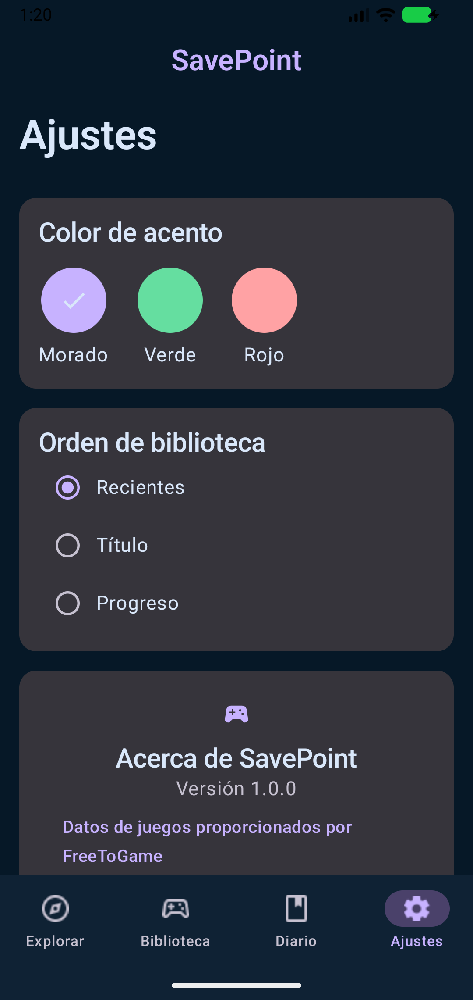

# SavePoint

SavePoint es un diario personal de videojuegos para Android. Permite explorar el catálogo gratuito de FreeToGame, guardar juegos, actualizar su progreso, crear objetivos y registrar sesiones con una fotografía opcional.

El proyecto fue desarrollado como proyecto academico de Jetpack Compose, Navigation, MVVM, Repository, Clean Architecture, Room, DataStore, Retrofit, StateFlow y CameraX.

## Funciones principales

- Catálogo remoto con búsqueda y filtros de plataforma.
- Detalle del juego con portada, capturas, descripción y requisitos.
- Biblioteca local con estado y porcentaje de progreso.
- Objetivos personales por juego.
- Diario de sesiones disponible sin conexión.
- Fotografía opcional mediante CameraX y permiso en tiempo de ejecución.
- Tema exclusivamente oscuro.
- Acentos morado, verde y rojo persistidos con DataStore.
- Orden de biblioteca por fecha, título o progreso.
- Estados visibles de carga, contenido, error, vacío y reintento.

## Capturas

| Explorar | Detalle | Ajustes |
|---|---|---|
|  |  |  |

## API utilizada

SavePoint utiliza la API pública de [FreeToGame](https://www.freetogame.com/api-doc) para obtener el catálogo y los detalles de videojuegos gratuitos.

La integración se realiza mediante **Retrofit** y **Gson**, encargados de efectuar las solicitudes HTTP y convertir las respuestas JSON en objetos utilizados por la aplicación.

Se consumen los siguientes endpoints:

- `/games`: obtiene el catálogo de videojuegos.
- `/game?id={id}`: obtiene la información detallada de un juego.

La API no requiere una clave de acceso (**API Key**). Los juegos obtenidos pueden consultarse desde la sección **Explorar** y guardarse posteriormente en la biblioteca local del usuario.

## Estructura

```text
com.example.app_savepoint
├── data
│   ├── local          # Room y DataStore
│   ├── mapper         # DTO/entidad ↔ dominio
│   ├── remote         # Retrofit y DTO de FreeToGame
│   └── repository     # Implementación del contrato
├── domain
│   ├── model          # Modelos independientes de Android
│   └── repository     # SavePointRepository
├── di                 # AppContainer, inyección manual
└── ui
    ├── camara
    ├── componentes
    ├── estado
    ├── navegacion
    ├── pantallas
    ├── theme
    └── viewmodel
```

Los ViewModels no importan DAOs, Retrofit ni DataStore. Sólo dependen de `SavePointRepository`.

## Requisitos

- Android Studio compatible con AGP 9.3.1.
- JDK incluido con Android Studio.
- Android SDK 37 para compilar.
- Dispositivo o emulador con Android 8.0 (API 26) o superior.

## Ejecutar

1. Clonar el repositorio y abrirlo en Android Studio.
2. Esperar la sincronización de Gradle.
3. Seleccionar un emulador o dispositivo.
4. Ejecutar la configuración `app`.

## Verificación

```powershell
.\gradlew.bat test
.\gradlew.bat assembleDebug
```

## Privacidad y permisos

- La cámara se solicita sólo cuando el usuario intenta adjuntar una foto.
- La sesión puede guardarse sin fotografía si el permiso es rechazado.
- Las fotografías se almacenan en el directorio privado de la aplicación.
- No se solicita permiso de almacenamiento.
- No hay cuentas, Firebase, ubicación, nube ni rastreo.
