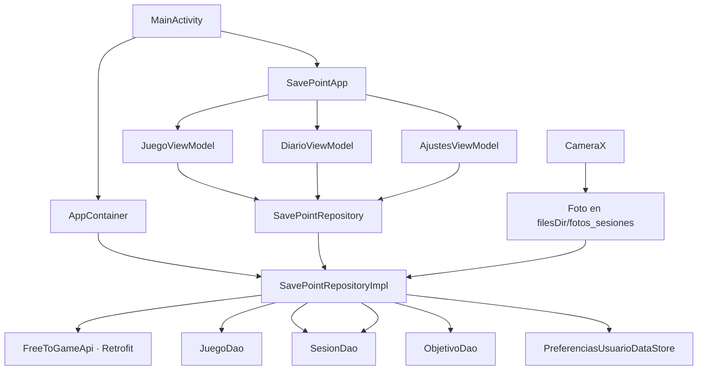
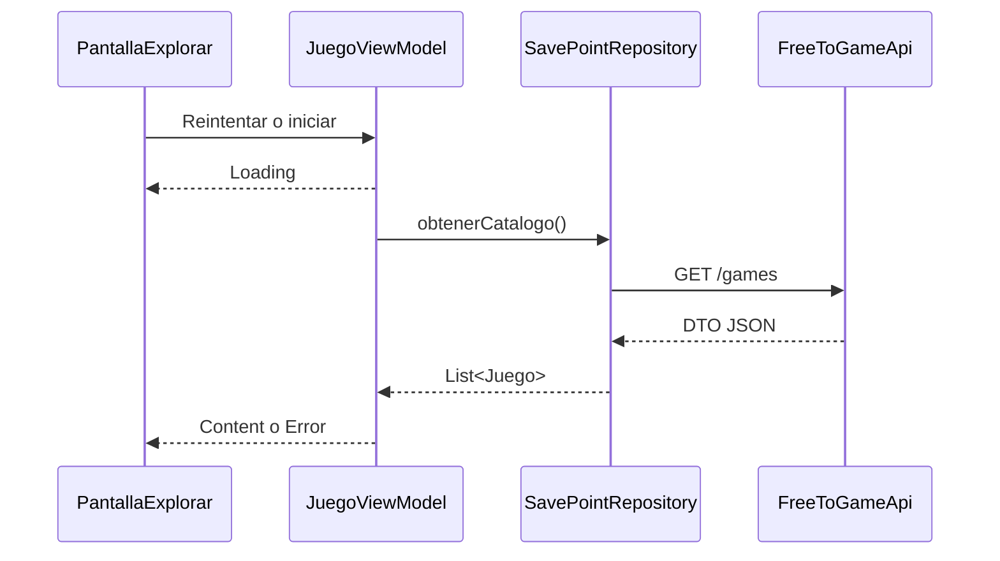
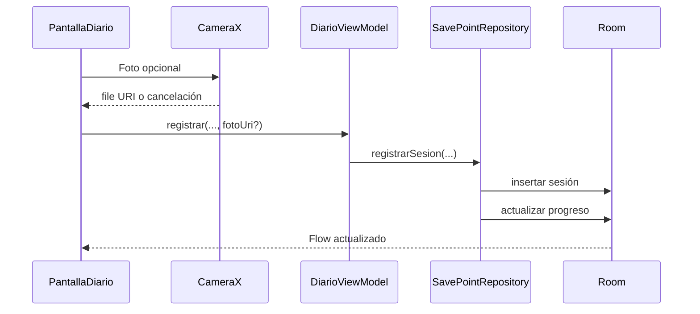

# Arquitectura de SavePoint

## Flujo principal

## Responsabilidades

| Capa | Responsabilidad | No debe conocer |
|---|---|---|
| `ui` | Renderizar estados, capturar acciones y navegar | Implementación de Room o Retrofit |
| `ui/viewmodel` | Coordinar casos de uso y exponer `StateFlow` | DAOs, DTO y clientes HTTP |
| `domain` | Modelos y contrato estable del repositorio | Android, Compose, Room y Retrofit |
| `data/repository` | Combinar orígenes remotos y locales | Componentes visuales |
| `data/remote` | Definir endpoints y DTO de FreeToGame | Estado de pantalla |
| `data/local` | Persistir biblioteca, sesiones, objetivos y ajustes | Navegación y Compose |

## Recorridos de datos

### Catálogo remoto

### Registro de una sesión

## Persistencia local

- `JuegoGuardado`: snapshot mínimo para que Biblioteca funcione sin conexión.
- `SesionJuego`: duración, nota, progreso y URI local opcional.
- `ObjetivoJuego`: objetivos asociados mediante clave foránea.
- DataStore: acento global y orden de Biblioteca.

Eliminar un juego aplica `CASCADE` sobre sus sesiones y objetivos. Las fotografías se borran cuando se elimina explícitamente su sesión mediante el repositorio.
